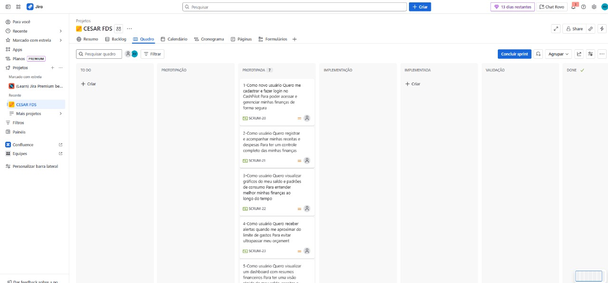
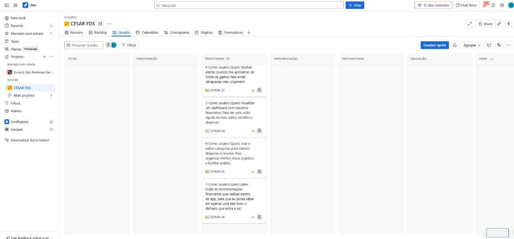
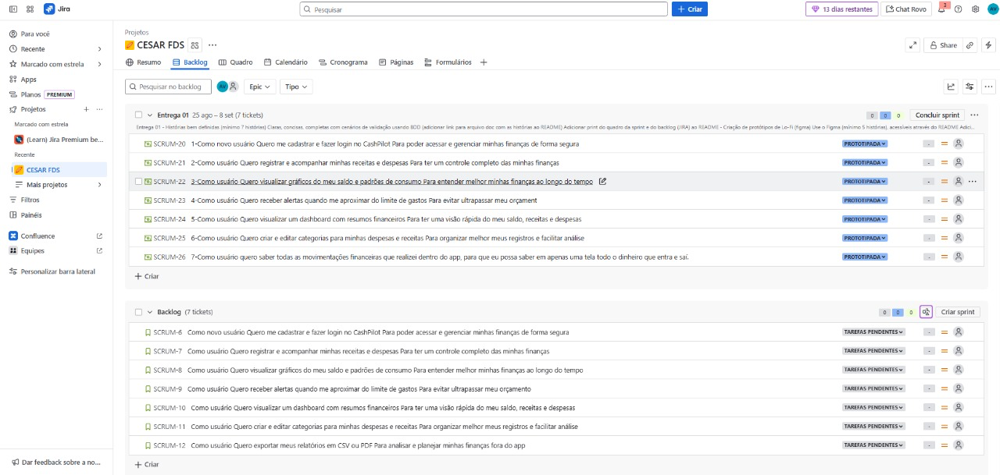
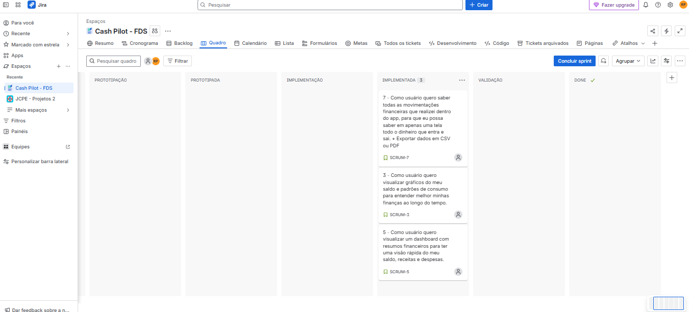
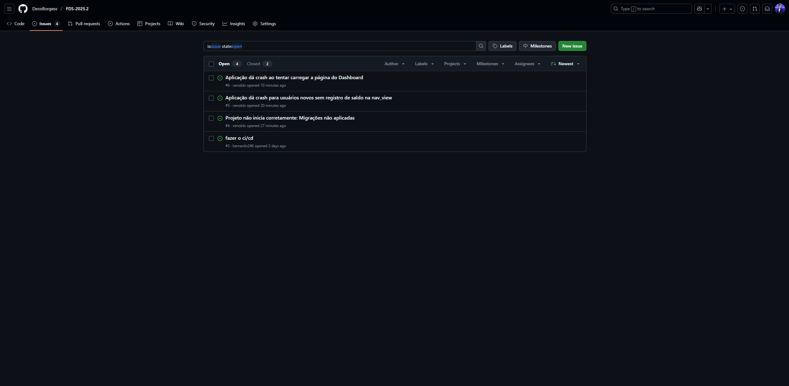

# CashPilot – Planner Financeiro Pessoal 💵

O **CashPilot** é um planner financeiro pessoal projetado para ajudar o usuário a gerenciar suas finanças de forma prática e eficiente.

- **Controle de receitas e despesas:** acompanhe todos os seus gastos e entradas em um só lugar.
- **Gráficos de evolução financeira:** visualize o crescimento do seu saldo e padrões de consumo ao longo do tempo.
- **Alertas de limite de gastos:** receba notificações automáticas ao se aproximar do limite definido, evitando surpresas no final do mês.

Com o CashPilot, planejar e organizar seu orçamento fica mais simples e seguro!

# Funcionalidades do CashPilot ⚙️

O **CashPilot** oferece ferramentas completas para gerenciar suas finanças pessoais de forma simples e eficiente:

- **Controle de receitas e despesas**  
  Registre e acompanhe todas as entradas e saídas de dinheiro em um só lugar.

- **Gráficos de evolução financeira**  
  Visualize de forma clara a evolução do seu saldo e os padrões de consumo ao longo do tempo.

- **Alertas de limite de gastos**  
  Receba notificações automáticas ao se aproximar dos limites definidos, ajudando a manter o orçamento sob controle.

- **Dashboard intuitivo**  
  Tenha uma visão geral rápida de suas finanças, com resumos diários, semanais ou mensais.

- **Categorias personalizáveis**  
  Organize despesas e receitas por categorias, facilitando a análise detalhada dos gastos.

- **Exportação de dados**  
  Exporte relatórios em CSV ou PDF para acompanhar e planejar suas finanças com mais precisão.

  
<h2><strong>Entrega 1</strong></h2>

   
  
  O objetivo desta primeira entrega é apresentar um vislumbre das fases iniciais do projeto CashPilot. Demonstramos parte de suas funcionalidades e os caminhos de evolução, já que aprimorar a experiência do usuário será fundamental para o desenvolvimento do site. Essa base servirá como ponto de partida para a evolução do nosso trabalho, permitindo ajustes e novas implementações nas próximas etapas.
   
   
  

   
    
    
    
</a>
    
  

### Quadro

### Backlog

  
<h2><strong>Entrega 2</strong></h2>

   
  
  Dando continuidade ao projeto, iniciamos sua execução de forma prática. Nosso foco, durante esta entrega, foi utilizar quatro histórias de usuário previamente definidas pelo grupo:

  - Login e Cadastro do usuário
  - Registrar nova receita
  - Registrar nova despesa
  - Categorias de despesas

  Nesta etapa, tivemos um primeiro entendimento do potencial do projeto ao colocarmos em prática a primeira entrega, o que nos preparou de forma mais sólida para o desenvolvimento das próximas fases.
   
   
  

    
  
    
  

  

### Quadro

### Deployment:

  O deploy pode ser visto através do link fornecido anteriormente. Para entrar no CashPilot, devem ser fornecidos o nome do usuário e a senha. Caso ainda não os tenha, deve ser feito antes o cadastro. Acessado o CashPilot, a tela inicial mostrará o saldo atual e quatro opções: Nova Receita, Nova Despesa, Gráficos e Movimentações Financeiras. Para adicionar uma nova receita, o usuário deve informar sua descrição, valor e data. Já na aba de adicionar nova despesa, o usuário deve colocar como descrição uma das categorias pré-definidas e, assim como fez com a receita, adicionar seu valor e data. Quanto a parte de gráficos, quatro estão disponíveis: o primeiro que mostra o saldo (positivo ou negativo) por mês, o segundo que mostra o saldo líquido, o terceiro que mostra as entradas e saídas do mês atual e o quarto e último, que mostra as saídas por categoria. Por fim, na parte de movimentações financeiras, está disponível um extrato contendo as entradas e saídas e suas descrições, valores e datas.

### Relato da programação em par:

**Dupla:** 
- Bernardo Leão
- André Borges

A programação em dupla foi feita da seguinte maneira, Bernardo começava a fazer o código enquando André tentava perceber algum possível erro. André também ficava comentando possíveis melhorias e relatava pontos com uma ótica diferente acerca do código.

**Membros:** 
- Luiz Eduardo
- Bernardo Leão
- André Borges
- Vinicius Gomes
- Júlio

Trabalhando em cojunto desenvolvemos a parte do backend para as páginas de login e logout, de forma que Bernardo e Luiz Eduardo escreveram o código enquanto os outros assumiram a função de corretores do código e propuseram comentários de melhorias.

**Membros:**
- Rodrigo Paiva
- Felipe Braz
- Pedro Canel

Pedro ficou responsável pela criação da base do html, além de ajudar Rodrigo na criação das páginas html e css do Cash Pilot. Enquanto isso, Felipe revisou todas as páginas e incrementou elas, melhorando ainda mais o design e funcionalidade de cada uma. 

  

  
<h2><strong>Entrega 3</strong></h2>

   

   Nesta terceira etapa da entrega, demos continuidade a execução prática do projeto, sendo implementadas as seguintes histórias:
   
   - visualizar gráficos de evolução financeira
   - visualizar extrato financeiro
   - exportar dados em CSV ou PDF.

   
   
  

    
  
    
  

  

  

### Quadro

### Bug

### Deployment:

  Nesta terceira etapa, o deploy do CashPilot foi atualizado com novas funcionalidades que aprimoram a experiência do usuário e ampliam as formas de visualização e análise financeira. Agora, é possível visualizar gráficos de evolução financeira, permitindo acompanhar o desempenho ao longo do tempo de maneira clara e intuitiva. Além disso, foi implementada a visualização de extrato financeiro, reunindo as principais informações de receitas e despesas em um só lugar, de forma organizada e acessível. Por fim, foi adicionada a opção de exportar dados em formato CSV ou PDF, possibilitando ao usuário salvar e compartilhar suas movimentações financeiras fora da aplicação.

### Relato da programação em par:

**Dupla:** 
- Bernardo Leão
- André Borges

Semelhante a estratégia de trabalho em equipe da entrega 2, a programação em dupla foi feita de tal maneira que Bernardo fez o código enquando André fazia possíveis correções no código.

**Membros:** 
- Luiz Eduardo
- Bernardo Leão
- André Borges

Bernardo e Luiz Eduardo escreveram o código enquanto André fazia correções e dava ideias de melhorias.

**Membros:** 
- Felipe Braz
- Pedro Canel

Pedro ficou responsável pela criação da base do html. Enquanto isso, Felipe revisou todas as páginas e incrementou elas, melhorando ainda mais o design e funcionalidade de cada uma. E Felipe ficou responsavel pelo deploy.

**Membros:**
- Júlio Gusmão
- Vinicius Gomes
- Rodrigo Paiva

Ficaram responsáveis pela atualização tanto do Jira, quanto do Readme.

  

  
<h2><strong>Entrega 4</strong></h2>

   

   Na quarta etapa da entrega, finalizando a execução prática do projeto, foi implementada a última história que restava:
   
   - Alerta de limite de gastos.

   
   
  

    
  
    
  

  

  
